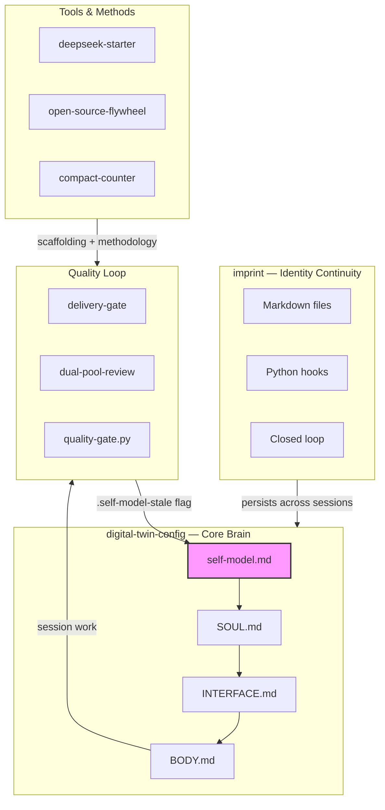

### AI quality + identity. Built one session at a time.

I build verification layers between "AI did it" and "you can trust it."
Each piece started as something missing from my own workflow.
Shipped through community review, hardened by 50+ real sessions.

---

## How it fits together

> The **strange loop**: self-model guides behavior → behavior produces quality data →
> quality gate writes a flag → next session, self-model regenerates from that flag.
> The system knows when it's outdated and fixes itself.

---

## Visitor's Path — where to start

**First visit?** Read in this order:

| # | Start with | You'll understand |
|---|-----------|-------------------|
| 1 | [digital-twin-config](https://github.com/YuhaoLin2005/digital-twin-config) | The brain — SOUL/INTERFACE/BODY architecture and why it exists |
| 2 | [imprint](https://github.com/YuhaoLin2005/imprint) | How identity survives session resets without a database |
| 3 | [gategrow/checkgrow](https://github.com/gategrow/checkgrow) | The full quality framework — gates, reviews, format audits |
| 4 | [gategrow/delivery-gate](https://github.com/gategrow/delivery-gate) | The Stop hook that blocks Claude from shipping without learning capture |
| 5 | [gategrow/dual-pool-review](https://github.com/gategrow/dual-pool-review) | Adversarial code review with fixed + random persona pools |

**Want something working today?** → [deepseek-claude-code-starter](https://github.com/YuhaoLin2005/deepseek-claude-code-starter)

**Want the meta-story?** → [open-source-flywheel](https://github.com/YuhaoLin2005/open-source-flywheel)

---

## Full ecosystem

| Repo | What it does | Role in system |
|------|-------------|----------------|
| [digital-twin-config](https://github.com/YuhaoLin2005/digital-twin-config) | SOUL/INTERFACE/BODY + strange loop | Brain — defines identity and behavior |
| [imprint](https://github.com/YuhaoLin2005/imprint) | Identity continuity protocol | Memory — survives session resets |
| [delivery-gate](https://github.com/gategrow/delivery-gate) | Stop hook quality gate | Output guard — blocks shipping without capture |
| [dual-pool-review](https://github.com/gategrow/dual-pool-review) | Adversarial code review system | Review — fixed + random persona pools |
| [checkgrow](https://github.com/gategrow/checkgrow) | Framework overview + methodology | Hub — ties gates, reviews, audits together |
| [deepseek-claude-code-starter](https://github.com/YuhaoLin2005/deepseek-claude-code-starter) | Claude Code + DeepSeek scaffold | On-ramp — working setup in minutes |
| [open-source-flywheel](https://github.com/YuhaoLin2005/open-source-flywheel) | Personal → open source methodology | Process — how these were built |
| [compact-counter-concept](https://github.com/YuhaoLin2005/compact-counter-concept) | LLM context compaction research | Research — when does compression help? |

---

## Proven

- Delivery-gate merged into [ECC](https://github.com/affaan-m/ECC) (100K★) — 4 bot rounds, 9 bugs caught. Reviewed by **daltino** and **affaan-m**.
- Adversarial review merged into [claude-skills](https://github.com/alirezarezvani/claude-skills) (18.7K★) — **co-authored-by** attribution from **alirezarezvani**.
- Quality gate reviewed by **xg-gh-25** on [anthropics/skills](https://github.com/anthropics/skills) (154K★).
- Format-consistency anti-pattern in [agent-best-practices](https://github.com/NextFrontierBuilds/agent-best-practices).

> Full contribution record: [github-contributions.md](https://github.com/YuhaoLin2005/claude-config/blob/master/projects/C--Users-86131/memory/github-contributions.md)

---

Most work starts with noticing something missing. Not talent — just paying attention.
