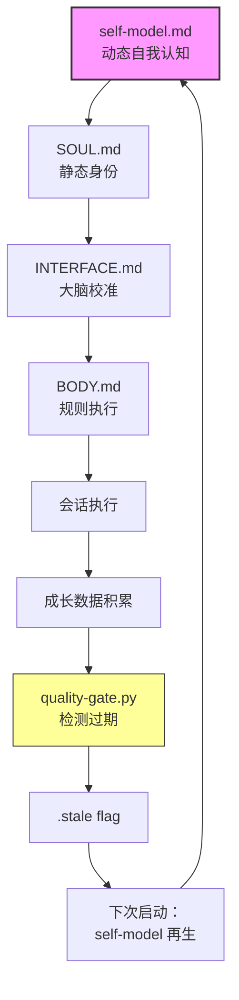

# Yuhao Lin

> 2027届本科在读 · AI 系统设计 · 2026 暑期实习求职中
> 
> 问题驱动——同一问题追三层：agent 层→理论层→模型层。
> 150+ session 验证，零依赖，本地可控。

---

## 🏗️ Active — 三层堆栈

_同一问题（AI 输出不可靠），三种深度。按从浅到深排列：_

| 层 | 仓库 | 问题 | 方法 | 状态 |
|---|------|------|------|:--:|
| **Agent** | [gategrow](https://github.com/YuhaoLin2005/gategrow) | AI agent 产出没有质量门 | 确定性质量门禁，5步闭环，4/5 机械化 | 已并入 ECC |
| **Theory** | [hermes-workspace](https://github.com/YuhaoLin2005/hermes-workspace) | LLM 长会话为什么会漂移 | J-space 收敛演化（独立复现 Anthropic），causal swap p=0.0092 | 实验完成 |
| **Model** | [training-gate](https://github.com/YuhaoLin2005/training-gate) | loss 降了模型崩了——损失函数不告诉你 | 行为漂移检测（BLEU×digit×repetition），HF Evaluate PR #778 | HF 待审核 |

```
gategrow ──→ hermes-workspace ──→ training-gate
"门住质量"     "理解为什么"         "测到看不见的崩"
```

---

## 🧪 Experiments — 已完成，只读

| 仓库 | 是什么 | 
|------|------|
| [deepseek-claude-code-starter](https://github.com/YuhaoLin2005/deepseek-claude-code-starter) | DeepSeek V4 跑在 Claude Code 里的脚手架。MIT。2★ |
| [compact-counter-concept](https://github.com/YuhaoLin2005/compact-counter-concept) | LLM 上下文压缩不是线性的——早期压缩能改善输出。找你的模型甜点。MIT |

---

## 🔗 Contributions — 我给大型项目提交的代码

| 项目 | 规模 | 我做了什么 | 状态 |
|------|:--:|------|:--:|
| [affaan-m/ECC](https://github.com/affaan-m/ECC) | 200K+★ | delivery-gate 质量门禁 + Stop hook | ✅ 已合并 |
| [alirezarezvani/claude-skills](https://github.com/alirezarezvani/claude-skills) | 21K+★ | named-persona 对抗审查（共作署名） | ✅ 已合并 |
| [huggingface/evaluate](https://github.com/huggingface/evaluate) | — | behavioral_drift 行为漂移检测指标 | 📋 PR #778 |
| [anthropics/skills](https://github.com/anthropics/skills) | 154K+★ | 质量门提案 + SOUL/INTERFACE/BODY 架构 | 📋 已审查 |
| [daymade/claude-code-skills](https://github.com/daymade/claude-code-skills) | 1.2K+★ | marketplace 验证 + Windows 兼容 | ✅ 已合并 |

---

## ✍️ Writing

- [DEV.to/yuhaolin2005](https://dev.to/yuhaolin2005) — 19 posts in English: AI agents, config engineering, prompt architecture
- [掘金/YuhaoLin2005yhl](https://juejin.cn/user/4250072430682412/posts) — 7 篇中文深度: J-space, 因果实验, 奇异环, 行为漂移
- [LEARNING.md](./LEARNING.md) — 公开学习日志：翻车→修正→再生。不是教程，是过程。

---

## 🧠 Architecture (deep dive)



> 5 步闭环，4 步机械脚本，1 步 AI 合成。机器做检查，人做判断。

---

Most work starts with noticing something missing. Not talent — just paying attention.
