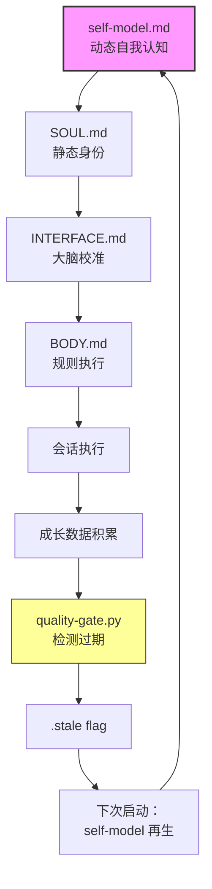

# Yuhao Lin | AI Agent 系统设计与可信工程

> 2027届本科在读 · 聚焦 **AI 数字分身架构** 与 **大模型输出质量治理**
>
> 从零搭建了一套基于文件系统的自治型 Agent 系统，具备身份永续与自我净化能力。
> 150+ 真实 session 验证，零依赖，数据完全本地可控。
>
> 📡 开源验证：向 ECC (100K★) / Anthropic Skills (154K★) / Claude Skills (18.7K★) 提交架构级提案
> 🎯 求职意向：AI 应用架构 / LLM Ops / AI 技术产品 实习

---

## 核心项目：自治型数字分身系统

**三个闭环，一套系统：**

```
身份永续闭环                  自我净化闭环                  开源验证闭环
SOUL/INTERFACE/BODY         自检→对抗审查→交付门禁         提取模块→找社区缺口
       ↓                         ↓                         PR打磨→社区验证
  self-model 再生           失败模式沉淀→成长日志          反哺回主系统
       ↓                         ↓                         ↓
  跨会话不丢失                输出不可靠被拦截              模块被头部项目认可
```

### 核心组件

| 组件 | 仓库 | 能力 | 外部验证 |
|------|------|------|----------|
| 身份永续协议 | [imprint](https://github.com/YuhaoLin2005/imprint) | 跨会话身份连续性，零数据库持久化 | 50+ session 零身份崩溃 |
| 交付质量门禁 | [delivery-gate](https://github.com/gategrow/delivery-gate) | AI 输出硬拦截，双分层确定性校验 | 已集成进 ECC (100K★)，daltino approve |
| 双池对抗审查 | [dual-pool-review](https://github.com/gategrow/dual-pool-review) | 固定池+随机池交叉审查，真人原则驱动 | 合并进 claude-skills (18.7K★)，共作署名 |
| 统一质量框架 | [checkgrow](https://github.com/gategrow/checkgrow) | 全流程质量治理，失败模式库+成长日志 | 架构与 SwarmAI T-CBB 体系对齐 |

---

## 开源贡献与社区验证

| 目标项目 | Star | 贡献 | 审查者 | 状态 |
|---------|------|------|--------|:--:|
| [affaan-m/ECC](https://github.com/affaan-m/ECC) | 100K+ | delivery-gate 质量门禁 + growth-log 技能 | **daltino** approve + 留言赞扬 | ✅ 已合并 |
| [affaan-m/ECC](https://github.com/affaan-m/ECC) | 100K+ | delivery-gate Stop hook 部署 | **affaan-m** 亲自合并 | ✅ 已合并 |
| [anthropics/skills](https://github.com/anthropics/skills) | 154K+ | 四维推理质量门提案 + SOUL/INTERFACE/BODY 架构提案 | **xg-gh-25** 专业审查 | 📋 已审查 |
| [alirezarezvani/claude-skills](https://github.com/alirezarezvani/claude-skills) | 18.7K+ | named-persona 对抗审查技能 | **alirezarezvani** approve | ✅ 已合并 |
| [alirezarezvani/claude-skills](https://github.com/alirezarezvani/claude-skills) | 18.7K+ | self-model 再生技能 | 共作署名 | ✅ 已合并 |

> 完整贡献记录：[github-contributions.md](https://github.com/YuhaoLin2005/claude-config/blob/master/projects/C--Users-86131/memory/github-contributions.md)

---

## 系统架构（深潜区）



> 4 步是机械脚本（时间戳检查 / 退出码 / 审计日志），1 步需要 AI（内容合成再生）。
> 机器做检查，人和 AI 做判断。

### 完整生态

| 仓库 | 功能 | 系统角色 |
|------|------|----------|
| [digital-twin-config](https://github.com/YuhaoLin2005/digital-twin-config) | SOUL/INTERFACE/BODY + 奇异环 | 🧠 大脑 — 定义身份与行为 |
| [imprint](https://github.com/YuhaoLin2005/imprint) | 身份连续性协议 | 💾 记忆 — 跨会话不丢失 |
| [delivery-gate](https://github.com/gategrow/delivery-gate) | Stop hook 质量门禁 | 🛡️ 输出守卫 — 不合格即拦截 |
| [dual-pool-review](https://github.com/gategrow/dual-pool-review) | 对抗性代码审查 | 🔍 审查 — 固定池+随机池 |
| [checkgrow](https://github.com/gategrow/checkgrow) | 统一质量框架 | 🏗️ 中枢 — 串联所有模块 |
| [deepseek-claude-code-starter](https://github.com/YuhaoLin2005/deepseek-claude-code-starter) | Claude Code + DeepSeek 脚手架 | 🚀 入口 — 一键部署 |
| [open-source-flywheel](https://github.com/YuhaoLin2005/open-source-flywheel) | 个人工具→开源的飞轮方法论 | 📖 方法论 — 怎么做的 |
| [compact-counter-concept](https://github.com/YuhaoLin2005/compact-counter-concept) | LLM 上下文压缩 U 型曲线研究 | 🔬 研究 — 压缩即正则化 |

---

## 能力栈

`系统设计` `AI Agent 架构` `方法论沉淀` `Prompt Engineering` `开源社区协作` `Python 工程`

---

Most work starts with noticing something missing. Not talent — just paying attention.
